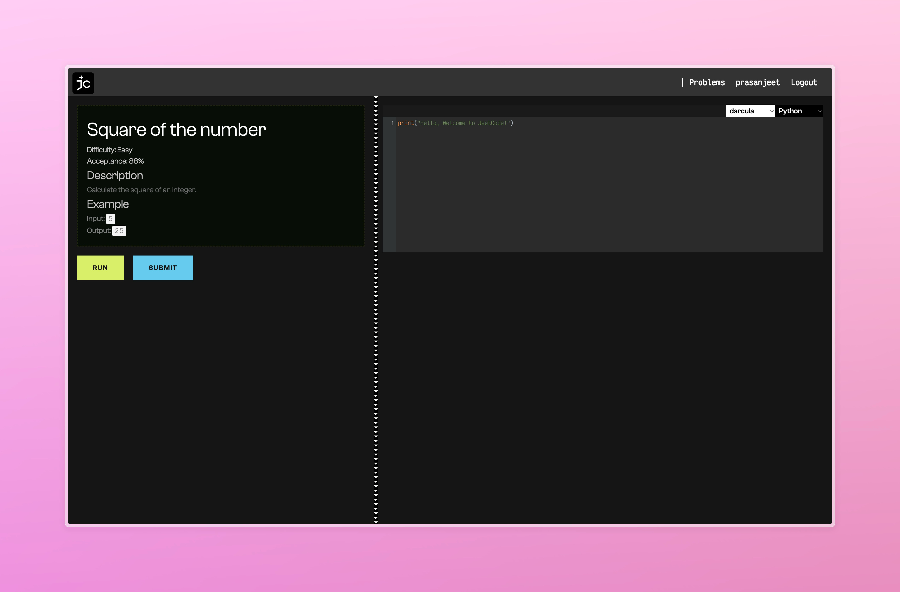
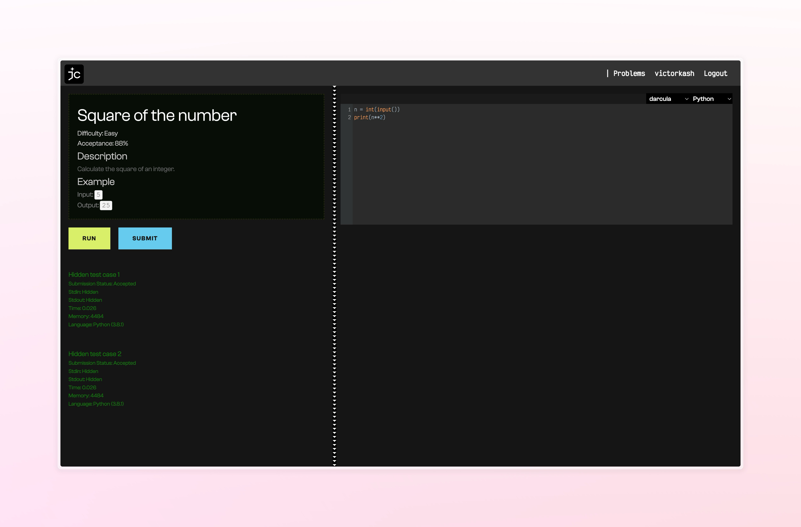

# 🚀 JeetCode: Level Up Your Coding Skills! 🚀

Welcome to JeetCode, where coding meets fun! 🎉 Sharpen your Data Structures and Algorithms skills with our LeetCode-inspired platform that's designed to make problem-solving an absolute blast! 💻🧠

JeetCode is live at [JeetCode](jeetcode.netlify.app)

## 🌟 Features That'll Blow Your Mind

### 🎨 Rich Browser-based IDE
Code in style with our sleek, feature-packed IDE right in your browser! No setup required – just dive in and start coding in your favorite language!

### 🧪 Test Your Might
- **Sample Test Cases**: Warm up with our carefully crafted sample inputs
- **Hidden Test Cases**: Think you've got it? Our secret tests will make sure!

### 🔍 Code Judge Extraordinaire
Get ready for some serious insights:
- 📊 Output vs. Expected Output
- ⏱️ Time Complexity Analysis
- 🧠 Memory Usage Breakdown

### 🎭 Beautiful UI That'll Make You Swoon
Check out our frontend repo and prepare to be dazzled:
[JeetCode Frontend](https://github.com/keshri-prasanjeet/JeetCode-frontend.git)

### 🔐 Fort Knox-level Security
Rest easy with our top-notch JWT token implementation. Your code is safe with us!

### 🚂 Powerful Backend
Built on the robust SpringBoot framework, our backend is ready to handle whatever you throw at it!

## 🚀 Try it out

JeetCode is live at [jeetcode](jeetcode.netlify.app)

## 📜 License

This project is licensed under the MIT License - see the [LICENSE.md](LICENSE.md) file for details.

## 🙌 Acknowledgments and Thanks

- Hat tip to LeetCode for the inspiration
- Virtual hugs to the open-source community
- CodeMirror for excellent code IDE
- Judge0 for open source code judging tool
---

Ready to jeet your coding skills to the next level? Dive in and happy coding! 🎊🔥

From KeshriXLabs

